# Research Assistant — Technical Documentation

> How the system works internally: architecture, data flow, and component connections.

---

## Table of Contents

1. [System Overview](#1-system-overview)
2. [Two Modes Explained](#2-two-modes-explained)
3. [Document Processing Pipeline](#3-document-processing-pipeline)
4. [Embeddings](#4-embeddings)
5. [Vector Store (ChromaDB)](#5-vector-store-chromadb)
6. [Prompt Templates](#6-prompt-templates)
7. [Retrieval QA Chain](#7-retrieval-qa-chain)
8. [Conversational Retrieval Chain](#8-conversational-retrieval-chain)
9. [Memory](#9-memory)
10. [Chains vs Agents](#10-chains-vs-agents)
11. [Agent Architecture (ReAct)](#11-agent-architecture-react)
12. [Tools](#12-tools)
13. [LLM Integration (Groq)](#13-llm-integration-groq)
14. [Full Request Lifecycle](#14-full-request-lifecycle)

---

## 1. System Overview

```mermaid
graph TD
    User["👤 User (Streamlit UI)"]
    Upload["PDF Upload"]
    Pipeline["Document Processing Pipeline\n(Load → Split → Embed → Store)"]
    ChromaDB[(ChromaDB\nVector Store)]
    SimpleMode["Simple Mode\nConversationalRetrievalChain"]
    AgentMode["Agent Mode\nReAct AgentExecutor"]
    DocTool["search_documents\ntool"]
    WebTool["search_web\ntool (Tavily)"]
    SumTool["summarize_content\ntool"]
    Memory["ConversationBufferWindowMemory\n(last 5 exchanges)"]
    LLM["LLM\nGroq · llama-3.3-70b-versatile"]
    Response["Response + Citations"]

    User -->|"asks question"| SimpleMode & AgentMode
    User -->|"uploads PDF"| Upload --> Pipeline --> ChromaDB
    SimpleMode --> ChromaDB
    SimpleMode --> Memory
    SimpleMode --> LLM
    AgentMode --> DocTool & WebTool & SumTool
    AgentMode --> Memory
    DocTool --> ChromaDB
    AgentMode --> LLM
    LLM --> Response --> User
```



The system has two phases:

| Phase | When | What happens |
|-------|------|--------------|
| **Indexing** | User uploads PDFs | PDF → chunks → embeddings → ChromaDB |
| **Querying** | User asks a question | Question → retrieve chunks → LLM → answer |

---

## 2. Two Modes Explained

### Simple Mode — `ConversationalRetrievalChain`

- **Always** searches uploaded PDFs. No choice involved.
- Predictable, fast, lower token cost.
- Suited for: "What does this paper say about X?"

### Agent Mode — ReAct `AgentExecutor`

- The LLM **decides** which tool(s) to call.
- Can chain multiple tool calls in one query.
- Suited for: complex research, current events, multi-source synthesis.


---

## 3. Document Processing Pipeline

**File:** `src/processing/document_processing_pipeline.py`

This runs when a user uploads PDFs. It has four sequential steps.

```mermaid
flowchart LR
    PDF["📄 PDF File(s)"]
    Load["1. DocumentLoader\nPyPDFLoader\n→ 1 Document per page"]
    Split["2. DocumentSplitter\nRecursiveCharacterTextSplitter\n→ ~1000 char chunks\n200 char overlap"]
    Embed["3. EmbeddingsGenerator\nall-MiniLM-L6-v2\n→ 384-dim vectors"]
    Store["4. ChromaVectorStore\nChroma.from_documents()\n→ persistent on disk"]

    PDF --> Load --> Split --> Embed --> Store
```



### Step 1 — Load (`DocumentLoader`)

`PyPDFLoader` reads the PDF and produces one `Document` object per page.

```python
Document(
    page_content="Artificial Intelligence is...",
    metadata={
        'source': 'paper.pdf',
        'page': 0,
        'filename': 'paper.pdf',
        'upload_date': '2025-02-21T10:30:00'
    }
)
```

### Step 2 — Split (`DocumentSplitter`)

`RecursiveCharacterTextSplitter` splits pages into overlapping chunks. It tries to break at semantic boundaries in this order: `\n\n` → `\n` → `.` → ` ` → characters.

**Config defaults:** `chunk_size=1000`, `chunk_overlap=200`

```
Original page (3000 chars):
[==============================================]

Chunks produced:
[chunk1: 0-1000  ]
        [chunk2: 800-1800  ]    ← 200-char overlap
                [chunk3: 1600-2600]
```

Overlap ensures that a key sentence split at a boundary still appears fully in at least one chunk.

### Step 3 — Embed (`EmbeddingsGenerator`)

Wraps `HuggingFaceEmbeddings` with `sentence-transformers/all-MiniLM-L6-v2`. Each chunk's text is converted to a 384-dimensional vector.

```
"What is neural scaling?" → [0.15, -0.32, 0.78, ..., 0.45]  ← 384 numbers
```

### Step 4 — Store (`ChromaVectorStore`)

Calls `Chroma.from_documents()` which iterates over chunks, generates embeddings, and writes vectors + text + metadata to disk.

**Critical connection:** The same `EmbeddingsGenerator` instance is passed to `ChromaVectorStore`. ChromaDB stores a reference to it internally (`_embedding_function`). During search, ChromaDB uses this same object to embed the query — ensuring both live in the same vector space.

---

## 4. Embeddings

**File:** `src/processing/embeddings.py`

**Model:** `sentence-transformers/all-MiniLM-L6-v2`
- Runs **locally** — no API calls, no cost
- 384-dimensional output vectors
- Trained on 1B+ sentence pairs for semantic similarity

**How a sentence becomes a vector:**

```mermaid
flowchart LR
    Text["'What is AI?'"]
    Tok["Tokenizer\n→ [101, 2054, 2003, ...]"]
    Trans["Transformer\n(BERT-style)\n→ hidden states"]
    Pool["Mean Pooling\n→ single vector"]
    Norm["L2 Normalize\n→ unit vector (384 dims)"]

    Text --> Tok --> Trans --> Pool --> Norm
```



**Semantic similarity in practice:**

Texts with similar meaning produce vectors that are close in cosine distance:
- `"What is machine learning?"` ≈ `"Explain ML"` → high cosine similarity (~0.9)
- `"What is machine learning?"` vs `"Recipe for pasta"` → low cosine similarity (~0.1)

This is why retrieval finds *meaning*, not just keywords.

---

## 5. Vector Store (ChromaDB)

**File:** `src/vectorstore/chroma_store.py`

ChromaDB is a local, embedded vector database. It stores vectors on disk under `data/vectorstore/` and uses **approximate nearest neighbour (ANN)** search providing O(log n) query performance.

### Key Methods

| Method | What it does |
|--------|-------------|
| `create_from_documents(docs)` | Indexes documents (indexing phase) |
| `load_existing()` | Reloads persisted store from disk |
| `similarity_search(query, k)` | Finds k most similar chunks to query |
| `as_retriever(k)` | Returns a LangChain `Retriever` for use in chains |

### Similarity Search Internals


**Cosine similarity formula:**

$$\text{similarity}(A, B) = \frac{A \cdot B}{\|A\| \cdot \|B\|}$$

Returns 1.0 for identical vectors, 0.0 for perpendicular, -1.0 for opposite.

---

## 6. Prompt Templates

**File:** `src/utils/prompts.py`

Prompts are the instructions sent to the LLM. LangChain's `PromptTemplate` uses `{variable}` placeholders filled at runtime.

### Templates in This Project

| Template method | Variables | Used by |
|-----------------|-----------|---------|
| `get_qa_prompt()` | `{context}`, `{question}` | `RetrievalQAChain` |
| `get_qa_with_sources_prompt()` | `{context}`, `{question}` | Emphasises citations |
| `get_conversational_prompt()` | `{chat_history}`, `{context}`, `{question}` | `ConversationalQAChain` |

### How a QA Prompt Is Assembled

```
You are a research assistant. Answer the question based on the provided context.

Context from documents:
{context}         ← filled with retrieved chunks joined by \n\n

Question: {question}   ← filled with user's question

Instructions:
- Answer based ONLY on the context provided
- If the answer isn't in the context, say "I don't have enough information"
- Include specific citations: mention the source document and page number
- Be concise but comprehensive

Answer:           ← LLM generates text from here
```

**Why "Answer based ONLY on the context"?** This prevents hallucinations — the LLM stays grounded in retrieved documents instead of generating plausible-sounding but incorrect facts.

---

## 7. Retrieval QA Chain

**File:** `src/chains/retrieval_qa.py`

`RetrievalQAChain` wraps LangChain's `RetrievalQA` for single-turn document Q&A. Each question is handled independently — no memory.


### Chain Types in LangChain

This project uses `chain_type="stuff"` — all retrieved chunks are stuffed into a single prompt.

| Type | How it works | When to use |
|------|-------------|-------------|
| **stuff** | All chunks in one prompt | Small-medium context (our choice) |
| **map_reduce** | Summarise each chunk, then combine | Very large document sets |
| **refine** | Iteratively refine answer with each chunk | Highest quality, slowest |
| **map_rerank** | Score each chunk's answer, pick best | When precision matters most |

---

## 8. Conversational Retrieval Chain

**File:** `src/chains/conversational.py`

Extends `RetrievalQA` with conversation memory. The key addition is **question reformulation** — resolving pronouns and references before retrieval.


**Why reformulation matters:**

Without it, the retriever would search for `"its applications"` — a pronoun with no vector meaning. Reformulation converts it to `"machine learning applications"` — a meaningful, searchable query.

The chain uses the LLM **twice**:
1. First LLM call: reformulate question (small, cheap)
2. Second LLM call: generate final answer (main call)

---

## 9. Memory

**File:** `src/memory/conversation_memory.py`

LangChain memory stores conversation history and injects it into prompts automatically.

**Type used:** `ConversationBufferWindowMemory` — keeps the **last k=5 exchanges** (10 messages).


### Why `output_key` Matters

LangChain chains return a dict with multiple keys. Memory needs to know which key holds the answer to save:

| Mode | `output_key` |
|------|-------------|
| Simple Mode (`ConversationalRetrievalChain`) | `"answer"` |
| Agent Mode (`AgentExecutor`) | `"output"` |

Setting the wrong `output_key` causes memory to fail silently — the agent can't build conversation context.

### Memory Types Available

| Type | Stores | Token cost | Use case |
|------|--------|-----------|----------|
| `ConversationBufferMemory` | All messages | Grows unbounded | Short sessions, debugging |
| `ConversationBufferWindowMemory` | Last k pairs | Fixed | **Production (our choice)** |
| `ConversationSummaryMemory` | LLM-generated summary | Low | Very long sessions |

---

## 10. Chains vs Agents

This is the most important conceptual distinction in this project.

```mermaid
flowchart TD
    subgraph Chain["🔗 Chain (Simple Mode)"]
        direction LR
        C1["Question"] --> C2["Retrieve from Docs\nalways"] --> C3["LLM generates answer"]
    end

    subgraph Agent["🤖 Agent (Agent Mode)"]
        direction TB
        A1["Question"] --> A2["LLM Reasons:\nwhich tool?"]
        A2 -->|"doc question"| A3["search_documents"]
        A2 -->|"current event"| A4["search_web"]
        A2 -->|"summary request"| A5["summarize_content"]
        A3 & A4 & A5 --> A6["LLM Observes result"]
        A6 --> A2
        A6 -->|"enough info"| A7["Final Answer"]
    end
```



| Dimension | Chain | Agent |
|-----------|-------|-------|
| Control flow | Fixed, deterministic | Dynamic, LLM-driven |
| Tool selection | Hardcoded (always retrieves) | LLM decides based on descriptions |
| Multi-step | No | Yes (loops until done) |
| Predictability | High | Lower (LLM can mis-route) |
| Token cost | Lower | Higher (reasoning overhead) |
| Best for | Document-only Q&A | Research needing multiple sources |

**Key insight:** A chain is a *fixed pipeline*. An agent is a *reasoning loop* where the LLM decides what to do next at every step.

---

## 11. Agent Architecture (ReAct)

**File:** `src/agent/research_agent.py`

The agent uses the **ReAct** pattern: **Re**asoning + **Act**ing.

```mermaid
flowchart TD
    Input["User Question"]
    Input --> Thought1["💭 Thought:\nAnalyse what's needed"]
    Thought1 --> Action1["⚡ Action:\nChoose tool + input"]
    Action1 --> Observe1["👁 Observation:\nTool output"]
    Observe1 --> Thought2["💭 Thought:\nIs this enough?"]
    Thought2 -->|"no, need more"| Action2["⚡ Action:\nNext tool"]
    Action2 --> Observe2["👁 Observation"]
    Observe2 --> Thought3["💭 Thought:\nI have enough"]
    Thought3 --> Final["✅ Final Answer"]
```



### ReAct Trace Example

```
Question: "What does the paper say about transformers, and are there recent papers?"

Thought: The user wants two things: paper content AND recent research.
Action: search_documents
Action Input: "transformers"
Observation: Found 4 chunks about transformers in uploaded paper...

Thought: I have the document info. Now I need recent papers from the web.
Action: search_web
Action Input: "recent transformer papers 2025"
Observation: Found 3 recent articles from arXiv...

Thought: I now have both sources. I can answer.
Final Answer: According to the uploaded paper, transformers... [source citations].
Recent developments include... [web sources].
```

### Agent Types Used

| Agent type string | LangChain enum | Memory support |
|-------------------|---------------|---------------|
| `"zero-shot-react-description"` | `ZERO_SHOT_REACT_DESCRIPTION` | No |
| `"conversational-react-description"` | `CONVERSATIONAL_REACT_DESCRIPTION` | **Yes (our default when memory provided)** |

When `memory` is injected into `ResearchAgent.__init__()`, the agent type is automatically overridden to `conversational-react-description` regardless of what's configured.

### Safety Limits

| Parameter | Default | Purpose |
|-----------|---------|---------|
| `max_iterations` | 5 | Prevents infinite loops |
| `early_stopping_method` | `"generate"` | Stop when confident, not just at iteration limit |
| `handle_parsing_errors` | `True` | Gracefully recover from malformed LLM outputs |

---

## 12. Tools

**Dir:** `src/tools/`

Tools are the "actions" the agent can take. Each tool extends `BaseTool` and has three required components:

```python
class MyTool(BaseTool):
    name: str = "tool_name"           # Identifier used in agent traces
    description: str = "When to use"  # ← THE MOST CRITICAL PART
    
    def _run(self, query: str) -> str: # Actual implementation
        ...
```

**The description is everything.** The agent's LLM reads tool descriptions to decide which tool to call. A vague description leads to wrong tool selection.

### Tool: `search_documents`

**File:** `src/tools/document_search.py`


Content is capped at 300 chars per chunk to control token usage within Groq's TPM limits.

### Tool: `search_web`

**File:** `src/tools/web_search.py`

Uses **Tavily API** — designed specifically for AI agents. Returns clean, relevant results without HTML noise.

Key limits applied to control token usage:
- `max_results=3` — only top 3 results
- Content capped at 400 chars per result
- URLs capped at 100 chars


### Tool: `summarize_content`

**File:** `src/tools/summarization.py`

Uses LangChain's `load_summarize_chain` with `chain_type="map_reduce"`:


`map_reduce` allows summarising content longer than the LLM's context window because each document is summarised independently before combining.

Two modes:
- Input contains `"all documents"` → retrieves 20 chunks, summarises all
- Any other input → retrieves 10 chunks for the specific topic

---

## 13. LLM Integration (Groq)

**File:** `src/utils/llm.py`


**Model:** `llama-3.3-70b-versatile`
- 70 billion parameters
- Long context window support
- Follows instructions reliably (critical for ReAct formatting)

**Key parameters:**

| Parameter | Default | Effect |
|-----------|---------|--------|
| `temperature` | 0.7 | Balanced creativity/determinism |
| `max_tokens` | 2000 | Caps response length (controls cost) |

**Temperature guide:**
- `0.0` — Deterministic. Same input → same output every time. Best for pure factual extraction.
- `0.3–0.5` — Slightly creative. Good for structured answers.
- `0.7` — Our default. Natural prose with slight variation.
- `1.0` — Creative but higher hallucination risk.

The LLM receives already-retrieved context in the prompt — it is **not** searching anything. It is only a text-in → text-out function.

---

## 14. Full Request Lifecycle

### Simple Mode: End to End


### Agent Mode: End to End


---

## Quick Reference: Component Map

```
Question enters the system
         │
         ▼
┌─────────────────────────────────────────────────────────────────┐
│  src/chains/conversational.py          src/agent/research_agent │
│  ConversationalQAChain                 ResearchAgent            │
│         │                                      │               │
│         ▼                                      ▼               │
│  ConversationalRetrievalChain          AgentExecutor           │
│         │                          (ReAct loop, max 5 steps)   │
│         │                    ┌───────────┬────┴────────────┐   │
│         ▼                    ▼           ▼                 ▼   │
│  src/vectorstore/       tools/         tools/           tools/ │
│  chroma_store.py        document_      web_search      summa-  │
│  ChromaVectorStore      search.py      .py             rization│
│         │                    │           │                 │   │
│         ▼                    ▼           ▼                 ▼   │
│  processing/embeddings  ChromaDB     Tavily API        ChromaDB│
│  EmbeddingsGenerator                                           │
│  (all-MiniLM-L6-v2)                                            │
└──────────────────────────┬──────────────────────────────────────┘
                           │
                           ▼
              src/memory/conversation_memory.py
              ConversationMemoryManager
              (last 5 exchanges, chat_history key)
                           │
                           ▼
              src/utils/llm.py → Groq API
              ChatGroq · llama-3.3-70b-versatile
                           │
                           ▼
                     Generated Answer
```
